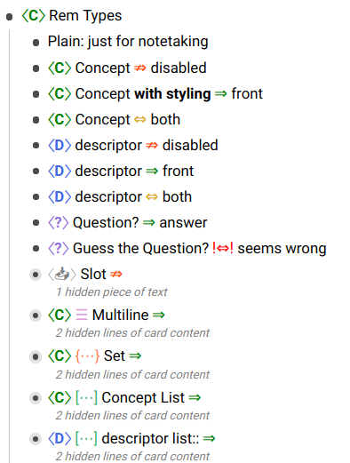

# RemNote Card Type Styles

A Custom CSS for [RemNote](https://www.remnote.io/) to change how flashcard generating rems look.

 

**Features:**

Visual indications for:

- practice direction
- rem types (plain, multi-line, list, set)
- card types (concept, descriptor, question [and slot]).

Allow custom text styling by resetting format for concept (bold) and descriptor (italic).

**Note:** There are still some glitches as the RemNotes markup is not easy to handle.

## Installation

The style consists of multiple modules of which you can chose the parts you want to enable:

- `practice-direction.css`: arrows (⇔, ⇏) instead of `::`
- `rem-type*.css`: Icons for Concept, Descriptor, Question and Slot. There are 2 variants of which you can chose one:
  - `rem-type.css`: Using RemNotes SVG icons.
  - `rem-type-simple.css`: Use `<C>`, `<D>`, `<Q>` and `<S>`.
- `card-type.css`: Icons for Multiline, List, Set.
- `text-style.css`: Disable bold/italic formatting for concept, question and descriptor.

1. Open the `Custom CSS` page in RemNote.
2. Create a new blank template block.
3. Paste the layout:
   1. If you want future updates and are ok with the defaults, import the features you want:
      ```css
      @import URL("https://hannesfrank.github.io/remnote-css-rem-types/practice-direction.css");
      @import URL("https://hannesfrank.github.io/remnote-css-rem-types/rem-type.css");
      /* OR: @import URL("https://hannesfrank.github.io/remnote-css-rem-types/rem-type-simple.css"); */
      @import URL("https://hannesfrank.github.io/remnote-css-rem-types/card-type.css");
      @import URL("https://hannesfrank.github.io/remnote-css-rem-types/text-style.css");
      ```
   2. If you want to tweak some stuff copy the code directly from the files above.

**Note:** If you do not want to get bothered by future updates, you can import a specific version with jsdelivr

```css
@import URL("https://cdn.jsdelivr.net/gh/hannesfrank/remnote-css-rem-types@8fe69d0/card-types.css");
```

## Contributing

I am not a designer. This is just a proof of concept.
If you have a good design, feel free to open an Issue to discuss.

If you can improve something a Pull Request is very welcome!

### Developing with Live Reload

Setup a workspace in Chrome DevTools. See e.g. [StackOverflow: How to save CSS changes of Styles panel](https://stackoverflow.com/questions/6843495/how-to-save-css-changes-of-styles-panel-of-chrome-developer-tools).

- Serve the project folder on e.g. `localhost:5500`. I don't know yet if this has to be a live server, but probably not as Chrome accesses the file system directly.
- Add the styles in development to RemNote like this:

```
@import URL("http://127.0.0.1:5500/practice-direction.css");
@import URL("http://127.0.0.1:5500/rem-type.css");
@import URL("http://127.0.0.1:5500/card-type.css");
@import URL("http://127.0.0.1:5500/text-style.css");
```

- Open DevTools > Sources > Filesystem and add the project folder as a workspace using the little `+`. The icon of the corresponding `.css` files should have a little green circle now and hovering over the icon shows how they are linked.
- You can edit now both in your editor and in DevTools. I recommend enabling autosave in your text editor.
